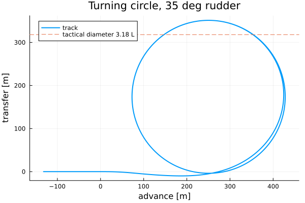

# DyadShip

A [Dyad](https://help.juliahub.com/dyad/) port of the Modelica naval-architecture
library [ShipSIM](https://github.com/BasilioPV/ShipSIM) by Basilio Puente and
M Dolores Fernandez, built on the 3D `MultibodyComponents` library, plus a
WaterLily.jl CFD-driven Flettner rotor propulsor.

> **This is a rewrite, not a translation.** The Modelica components have been
> reimplemented in Dyad on top of `MultibodyComponents`, `RotationalComponents`,
> `BlockComponents` and the rest of the Dyad standard libraries. Per-component
> docstrings state what was simplified or corrected relative to upstream;
> `PORTING_NOTES.md` is the map of what exists, what changed and what was left out.

## Six-degree-of-freedom ship (`dyad/Ship6DOF`)

The primary stack mirrors ShipSIM's architecture on `Frame3D` connectors:

| Component | What it does |
|---|---|
| `ShipBody` | Rigid body (yaw-pitch-roll Euler angles) with draft-polynomial hydrostatics: displacement, centre of buoyancy and metacentric radii as functions of the instantaneous draft, heel and trim. |
| `HydrodynamicXYY` | MMG surge/sway/yaw forces with the empirical derivative estimates of Clarke, Smitt, Khattab, Lee & Shin, Kijima and Yoshimura, resistance curve, and added mass with the coupling terms. Forces act at the centre of forces, so a turn heels the hull. |
| `HydrodynamicZRP` | Heave/roll/pitch damping and added mass, with defaults from damping ratios. |
| `Propeller1Q` / `Propeller4Q` | Wageningen B-series open-water characteristics: the full Oosterveld & van Oossanen polynomial, or the 14 four-quadrant Fourier data sets for astern and crash-stop work. Both feed the rudder with Brix's slipstream model. |
| `Rudder` | Steering-gear angle and rate limits, NACA 0012/0015 `Cl/Cd/Cm(α, Re)` tables (`assets/naca*.csv`), flow straightening, Söding slipstream and hull-interaction factors. |
| `ShipWind` | Fujiwara superstructure wind loads at the centre of the lateral area. |
| `ApparentSpeedXY` | Frame-based apparent wind / current sensor. |
| `WaypointAutopilot` | `LimPID` heading autopilot with throttle ramp. |
| `StandardShip` | The ShipSIM sample hull (100 m, 5681 t) with propeller, rudder and hydrodynamics wired up; the manoeuvring analyses extend it. |

### Validation

`scripts/validate_6dof.jl` runs the standard manoeuvring tests and writes the
figures in `assets/ship6dof_*.png`. Results for the sample hull (rudder rate
2.5 °/s, approach 6.69 m/s, 100 rpm unless noted):

| Analysis | Result |
|---|---|
| `RollDecayTransient` | roll period 9.1 s (linear estimate 8.4 s; the difference is the sway added-mass coupling of a hull rolling about a CoG 5 m above its hydrodynamic centre), damping ratio 0.047 for the 0.05 setting |
| `SpeedTrialTransient` | 6.05 m/s at 100 rpm, thrust 129 kN against 128 kN resistance, 1.1 MW shaft power |
| `TurningCircleTransient` (35°) | advance 3.9 L, transfer 0.7 L, tactical diameter 3.2 L; steady turn at 44 % of approach speed, 0.95 °/s, 35° drift, 0.35° outward heel |
| `RudderReturnTransient` | yaw rate halves 24 s after the rudder is centred and decays to zero |
| `ZigZagTransient` (20/20) | overshoot angles 32°, 31°, 27° |
| `CrashStopTransient` | 110 rpm ahead to 80 rpm astern: stopped after 287 s, head reach 9.9 L |
| `FullShip6DOFTransient` | 10 km waypoint transit in a 10 m/s wind from the north-east: arrives at 1768 s holding a 3.8° rudder offset and 0.2° heel |



The zig-zag overshoots are large because the upstream Khattab estimate of the
yaw damping leaves the bare hull linearly course-unstable
(`HydrodynamicXYY.CourseStability < 0`); the rudder's fin effect holds the
course. Override `N_r` for a stiffer hull.

`ManualShip6DOFTransient` exposes shaft rpm and rudder angle as tunable
parameters for interactive (WASM) use.

## Planar stack and Flettner rotor

`dyad/Ship` and `dyad/Propulsion` hold the earlier `PlanarMechanics`
(surge/sway/yaw) port: `HullMMG`, `Rudder`, `Propeller1Q/4Q`, `POD4Q`,
`WingSail`, `ShipWind`, `HeadingAutoPilot`, `ManualShip`, the `FullShip*`
transits and the Flettner-rotor propulsor. Two sign errors in it were fixed
in this pass (rudder inflow angle, wind lateral force and moment); its
analyses still use a hull mass well below the sample ship's displacement, so
prefer `Ship6DOF` for manoeuvring studies.

The `FlettnerRotor` component reads `Cl(ξ)`, `Cd(ξ)` from
`assets/flettner_coeffs.csv`, produced offline by
`scripts/run_waterlily_flettner.jl` from WaterLily.jl simulations of a
rotating cylinder in cross-flow (G. D. Weymouth's SpinCyl pattern). Three
rendered transits compare diesel-only, rotor with bow-quarter wind and rotor
with beam wind:

| Analysis | Rotor | Mean wind from | Time to target |
|---|---|---|---|
| `ShipRenderTransient` | none | NE (45°) | not reached by 2200 s |
| `ShipFlettnerRenderTransient` | yes | NE (45°), bow quarter | not reached by 1500 s |
| `ShipFlettnerFavorableRenderTransient` | yes | N (0°), beam | reaches at t ≈ 1200 s |

<video src="assets/ship_flettner_favorable_animation.mp4" controls width="720">
  <a href="assets/ship_flettner_favorable_animation.mp4">assets/ship_flettner_favorable_animation.mp4</a>
</video>

`FlettnerRotorOnline` and `scripts/run_flettner_cosim_verification.jl` run
the same transit with WaterLily stepped live in a `PeriodicCallback`
(package extension `FlettnerCFDLiveExt`, GPU-capable through CUDA) to
verify the table approach; `assets/flettner_cosim_*` hold the comparison
plots and animations. Table and live CFD agree on shape, sign and
trajectory, with live magnitudes 20–30 % lower during the ramp-up.

## Getting started

Dyad models live in `dyad/`; the Dyad compiler emits Julia into `generated/`
(never edit those files). The wrappers `../julia-dyad.sh` and `../dyad.sh`
select the `dyad-3.3.0` JuliaUp channel and `dyad-cli@3.3.0`; run heavy
commands through `~/dyad-fleet/heavy` on this machine.

```sh
# Compile Dyad -> Julia
../dyad.sh compile

# Run an analysis from Julia
../julia-dyad.sh -e 'using DyadShip; res = DyadShip.Ship6DOF.TurningCircleTransient(); println(res.sol.retcode)'

# Manoeuvring validation report + figures
../julia-dyad.sh scripts/validate_6dof.jl

# Planar transit animations
../julia-dyad.sh scripts/render_all.jl

# Re-characterise the Flettner rotor with WaterLily (scripts/Project.toml)
../julia-dyad.sh --project=scripts scripts/run_waterlily_flettner.jl
```

Accessing results follows the Dyad convention:

```julia
using DyadShip
using DyadInterface: symbolic_container
res = DyadShip.Ship6DOF.ZigZagTransient()
m = symbolic_container(res)
heading_deg = rad2deg.(res.sol[m.ship.Yaw])
```

## Layout

- `dyad/Ship6DOF/` — 6-DOF ship stack, analyses, `definitions.jl` (Wageningen
  polynomials, four-quadrant Fourier sets, draft polynomials).
- `dyad/Ship/`, `dyad/Propulsion/` — planar stack, Flettner rotor, transits.
- `dyad/Machinery/` — crane, cable, on-off consumer, peak sampler.
- `dyad/Thermal/` — solar irradiation, sun screen, plate and cylinder
  transients, temperature dataset, dew point, air exchanger.
- `dyad/Environment.dyad`, `VariableEnvironment.dyad`, `ApparentSpeedXY.dyad` —
  signal-level environment helpers.
- `assets/` — wing-profile and Flettner coefficient tables, temperature CSV,
  validation figures, animations.
- `scripts/` — validation, rendering and WaterLily characterisation scripts
  (`scripts/Project.toml` carries the WaterLily/CUDA dependencies).
- `src/DyadShip.jl`, `ext/FlettnerCFDLiveExt.jl` — Julia module wrapper and
  the live-CFD extension.
- `PORTING_NOTES.md` — port status, conventions, corrections relative to upstream.
- `AGENTS.md` — toolchain notes and Dyad/MTK learnings for agents.

## License

The Dyad rewrite in this repository is © 2025 Panagiotis Georgakopoulos. The
upstream Modelica `ShipSIM` library is © Basilio Puente and M Dolores
Fernandez, distributed under the 3-clause BSD license.
